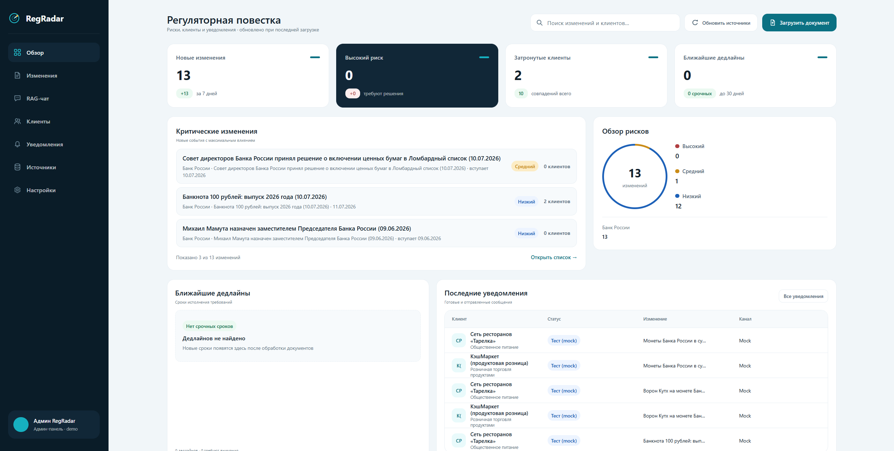
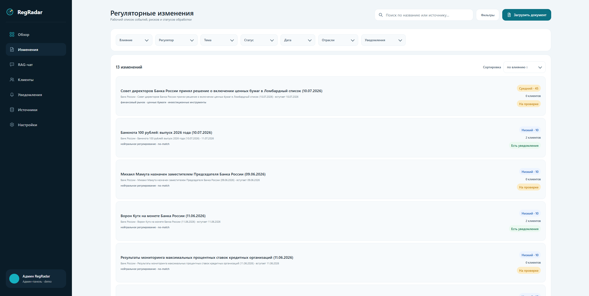
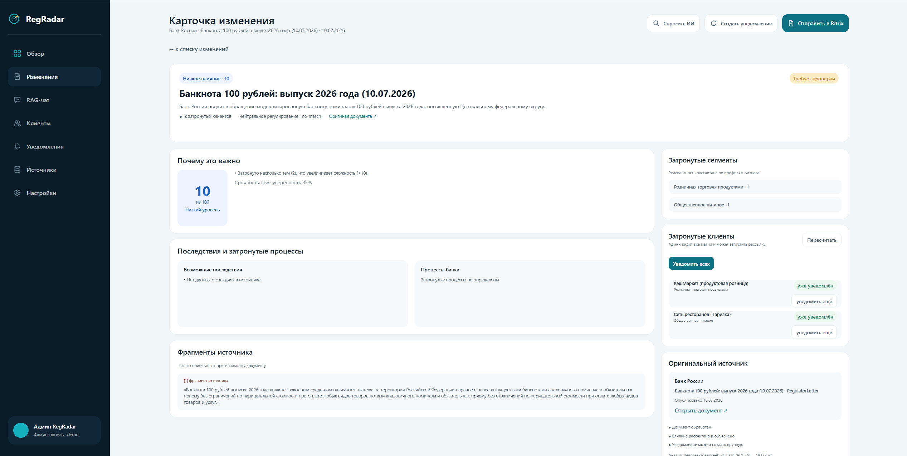
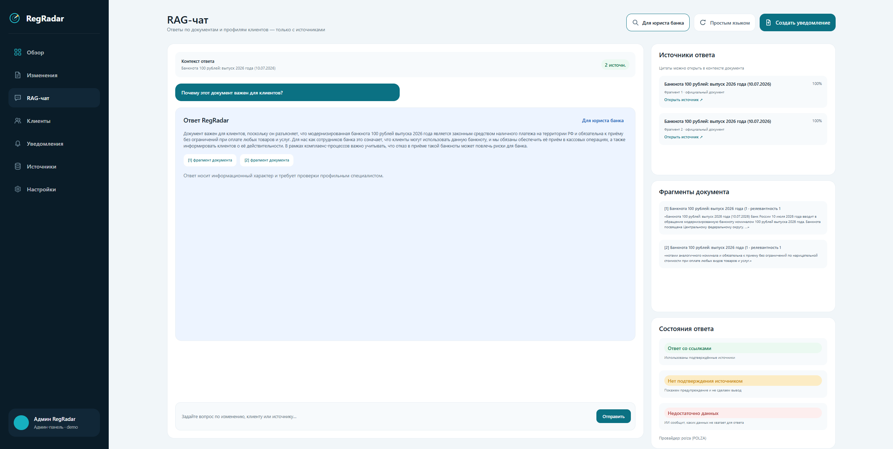
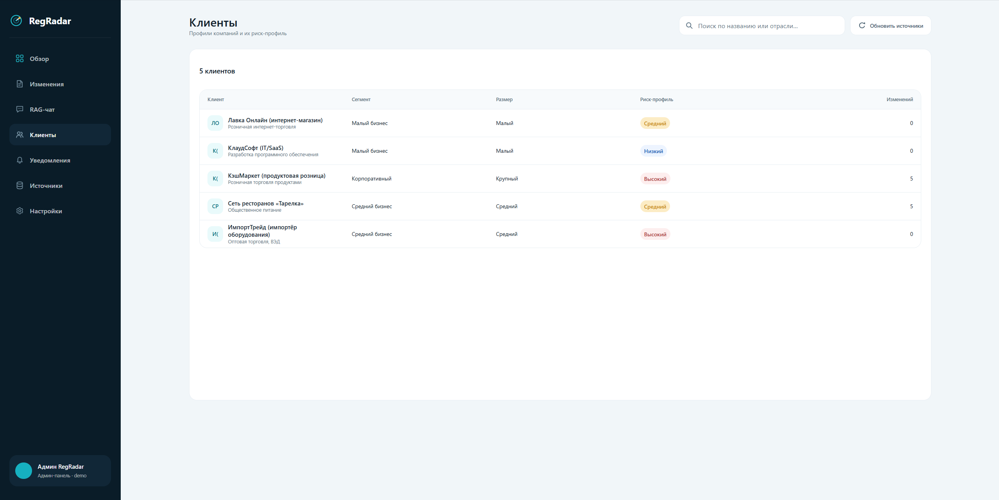
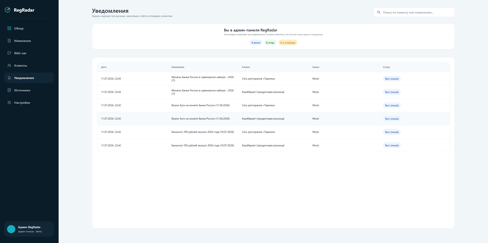
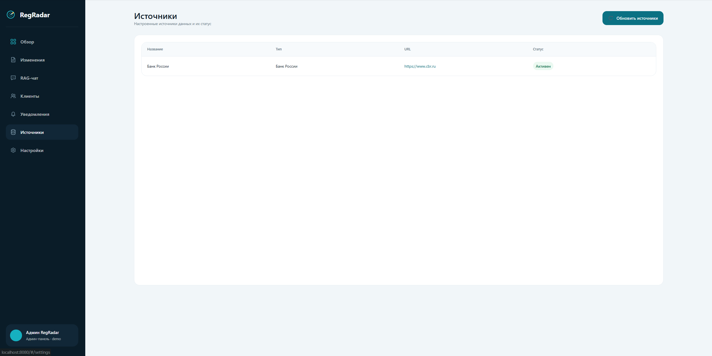

# RegRadar

RegRadar — рабочий MVP системы регуляторной разведки для банка. Система принимает регуляторные документы, извлекает и нормализует текст, отправляет его в AI-service, превращает результат в карточку регуляторного изменения, рассчитывает влияние на клиентский портфель и помогает подготовить уведомления клиентам.

Проект собран как end-to-end контур для демонстрации на хакатоне: есть backend API, PostgreSQL, Redis, background worker, встроенный web-интерфейс, отдельный AI-service, Docker Compose, seed-документы, тесты и real-doc evaluation.

## Что умеет система

- Загружать документы вручную: TXT/PDF/DOCX через `POST /api/Documents/upload` и web-интерфейс.
- Запускать ingestion из источников: seed-документы и RSS Банка России через `POST /api/Ingestion/run`.
- Извлекать, нормализовать и дедуплицировать текст документа.
- Делить документ на чанки и хранить исходный текст/версии/фрагменты.
- Вызывать отдельный AI-service по HTTP-контракту `POST /analyze`.
- Получать structured AI result: `DocumentAnalysis`, `ImpactAssessment`, `ClientRelevance`.
- Создавать карточку регуляторного изменения `RegulatoryEvent`.
- Рассчитывать затронутых клиентов и объяснять причины релевантности.
- Показывать карточки, клиентов, источники, уведомления и RAG-чат во встроенном frontend.
- Отправлять уведомления через Bitrix webhook или mock-режим.
- Логировать AI-вызовы, processing jobs и audit trail.
- Работать в demo/fallback режиме без внешнего LLM API.

## Архитектура

```text
Browser / wwwroot frontend
        |
        v
RegRadar.Api (.NET 10, REST API, static frontend)
        |
        |-- PostgreSQL + pgvector: documents, chunks, events, impacts, notifications, logs
        |-- Redis: infrastructure/cache/workflow dependency
        |-- RegRadar.Workers: scheduled ingestion
        |
        v
regradar_ai / FastAPI AI-service
        |
        |-- MockProvider, PolzaAIProvider, fallback
        |-- DocumentAnalysis LLM step
        |-- baseline impact/client matching
        |-- RAG-lite and audit/debug endpoints
        v
PolzaAI API, optional
```

Главный принцип: основной `.NET` backend отвечает за ingestion, хранение, API, статусы, карточки и пользовательский контур. AI-service отвечает за AI-анализ и возвращает structured result. Секреты PolzaAI не попадают во frontend и не нужны основному backend напрямую.

## Состав репозитория

| Путь | Назначение |
|---|---|
| `src/RegRadar.Api` | ASP.NET Core API, controllers, healthchecks, Scalar/OpenAPI, static frontend из `wwwroot` |
| `src/RegRadar.Application` | DTO, contracts, ports/abstractions приложения |
| `src/RegRadar.Domain` | Entities, enums, базовая доменная модель |
| `src/RegRadar.Infrastructure` | EF Core, ingestion, processing pipeline, AI/Bitrix adapters, impact engine |
| `src/RegRadar.Workers` | BackgroundService для периодического ingestion |
| `tests/RegRadar.Tests` | xUnit-тесты ключевых backend-сервисов |
| `src/RegRadar.Api/wwwroot` | Встроенный frontend: vanilla HTML/CSS/JavaScript |
| `regradar_ai` | Отдельный FastAPI AI-service с Dockerfile, тестами и документацией |
| `seed` | Seed-документы для стабильного demo-сценария |
| `Docs` | Исходные ТЗ, контракт с AI-модулем и презентационные материалы |
| `docker-compose.yml` | Полный запуск: postgres, redis, ai, api, worker |

## Быстрый запуск через Docker

Требования:

- Docker Desktop или совместимый Docker Engine.
- Свободные порты `8080`, `5432`, `6379`.

```powershell
git clone https://github.com/ivan443250/RegRadar_Backend.git
cd RegRadar_Backend
Copy-Item .env.example .env
notepad .env

docker compose up --build
```

Перед запуском откройте `.env` и заполните значения под своё окружение. Бездумно копировать `.env.example` не стоит: в нём есть примеры и placeholder-значения. Для demo можно оставить `BITRIX_WEBHOOK_URL` и `POLZA_API_KEY` пустыми — тогда уведомления и LLM будут работать в безопасных mock/fallback-режимах.

После старта:

| Сервис | URL |
|---|---|
| Web UI / API | http://localhost:8080 |
| Scalar API docs | http://localhost:8080/scalar/v1 |
| OpenAPI JSON | http://localhost:8080/openapi/v1.json |
| Health | http://localhost:8080/health |
| Readiness | http://localhost:8080/health/ready |

## Публичный demo-host

Для быстрой проверки без локального запуска доступен хост на личном сервере:

```text
http://157.22.230.202:8080/
```

Это demo-окружение. Для разработки и воспроизводимой проверки используйте локальный Docker Compose запуск.

AI-service внутри Docker network доступен основному backend как:

```text
http://ai:8000
```

Наружу AI-service портом не публикуется в `docker-compose.yml`, потому что штатный клиент AI-service — основной backend.

## Как пользоваться сайтом

Встроенный web-интерфейс доступен сразу после запуска backend. Локально он открывается по адресу `http://localhost:8080`, а demo-стенд доступен по адресу `http://157.22.230.202:8080/`.

Интерфейс устроен как админ-панель RegRadar для комплаенс-команды: слева находится основная навигация, справа — выбранный раздел. Внизу sidebar показан текущий режим входа: `Админ RegRadar`. Это означает, что пользователь видит общую картину по всем клиентам, изменениям и уведомлениям, а не личный кабинет одного сотрудника.

### 1. Обзор

Раздел `Обзор` — стартовый экран системы. Здесь видно общее состояние регуляторной повестки:

- сколько изменений найдено;
- сколько событий имеют высокий риск;
- сколько клиентов затронуто;
- есть ли ближайшие дедлайны;
- какие изменения сейчас самые важные;
- есть ли последние уведомления.

С этого экрана удобно начинать демо: он быстро показывает, что RegRadar — не просто форма загрузки документа, а цельный контур мониторинга, анализа и клиентских действий.

### 2. Изменения

Раздел `Изменения` — основной рабочий список регуляторных событий. Каждая строка показывает:

- название изменения;
- источник и дату;
- тему/домен;
- уровень влияния и score;
- количество затронутых клиентов;
- статус review.

На этом экране можно искать изменения, фильтровать список и открыть карточку конкретного события.

### 3. Карточка изменения

Карточка изменения — главный экран для объяснения результата AI-анализа. В ней собраны:

- краткое описание документа;
- почему изменение важно;
- impact score;
- затронутые процессы;
- возможные последствия;
- список затронутых клиентов;
- evidence/source fragments;
- статус проверки.

В блоке `Затронутые клиенты` администратор может действовать сразу из карточки:

- `Уведомить` — отправить уведомление конкретному клиенту;
- `Уведомить всех` — отправить уведомления всем затронутым клиентам по этому изменению;

Именно этот экран лучше всего показывает ценность RegRadar: система не просто классифицирует документ, а объясняет, почему он важен и кого затрагивает.

### 4. RAG-чат

Раздел `RAG-чат` позволяет задавать вопросы по документам и получать source-grounded ответы. Система должна отвечать только на основании доступных фрагментов документа. Если данных недостаточно, она показывает честное no-data состояние вместо выдуманного ответа.

Примеры вопросов:

- `Почему этот документ получил такой impact?`
- `Каких клиентов он затрагивает?`
- `Что банк должен проверить?`
- `Сформулируй объяснение клиенту простым языком.`

### 5. Клиенты

Раздел `Клиенты` показывает клиентский портфель, который используется для оценки релевантности изменений. Для каждого клиента видны:

- название;
- отрасль/сегмент;
- размер бизнеса;
- risk profile;
- количество связанных изменений.

Этот экран помогает объяснить, почему одно изменение затрагивает импортёра, другое — e-commerce, а нейтральные документы не должны массово рассылаться всем клиентам.

### 6. Уведомления

Раздел `Уведомления` — это общий админ-журнал всех отправок по системе. Он не фильтруется под одного пользователя: администратор видит, какому клиенту, по какому изменению, через какой канал и с каким статусом было отправлено сообщение.

Если уведомлений ещё нет, интерфейс показывает понятное пустое состояние. После ручной отправки из карточки клиента или массового действия `Уведомить всех` записи появляются в этом журнале.

Отправка работает через Bitrix webhook, если он задан в `.env`, или через безопасный mock-режим для демо.

### 7. Источники

Раздел `Источники` показывает подключённые источники регуляторных документов и их статус. Сейчас в demo-контуре есть источник `Банк России`, а также seed/upload сценарии для воспроизводимой проверки.

### 8. Настройки

Раздел `Настройки` используется как служебный экран для параметров demo-окружения и будущих настроек продукта.

## Demo-сценарий

1. Открыть frontend:

   ```text
   http://localhost:8080
   ```

2. Запустить ingestion:

   ```powershell
   curl.exe -X POST http://localhost:8080/api/Ingestion/run
   ```

3. Открыть раздел `Изменения` во frontend.
4. Выбрать карточку регуляторного изменения.
5. Посмотреть:
   - summary документа;
   - уровень влияния;
   - объяснение влияния;
   - затронутых клиентов;
   - источники/фрагменты;
   - уведомления.
6. Открыть RAG-чат и задать вопрос по документу.
7. В карточке изменения нажать `Уведомить` для одного клиента или `Уведомить всех` для массовой отправки.
8. Открыть `Уведомления` и показать общий админ-журнал отправок в mock/Bitrix-режиме.

Для стабильной демонстрации в проекте есть seed-документы в `seed/` и demo-клиенты, которые создаются при старте API.

## Основные API endpoints

### Служебные endpoints

| Метод | Путь | Назначение |
|---|---|---|
| `GET` | `/health` | Liveness healthcheck |
| `GET` | `/health/ready` | Readiness: PostgreSQL + Redis |
| `GET` | `/scalar/v1` | Scalar UI для OpenAPI |
| `GET` | `/openapi/v1.json` | OpenAPI JSON |

### Документы и ingestion

| Метод | Путь | Назначение |
|---|---|---|
| `GET` | `/api/Documents` | Список документов |
| `GET` | `/api/Documents/{id}` | Метаданные документа |
| `POST` | `/api/Documents/upload` | Загрузка PDF/DOCX/TXT |
| `GET` | `/api/Documents/{id}/text` | Нормализованный текст документа |
| `GET` | `/api/Documents/{id}/chunks` | Чанки документа |
| `POST` | `/api/Documents/{id}/reprocess` | Повторный AI-анализ документа |
| `POST` | `/api/Ingestion/run` | Ручной запуск ingestion |

### Регуляторные события и клиенты

| Метод | Путь | Назначение |
|---|---|---|
| `GET` | `/api/RegulatoryEvents` | Карточки регуляторных изменений |
| `GET` | `/api/RegulatoryEvents/{id}` | Одна карточка изменения |
| `GET` | `/api/RegulatoryEvents/{id}/impacts` | Затронутые клиенты |
| `POST` | `/api/RegulatoryEvents/{id}/impacts/recalculate` | Пересчёт влияния |
| `GET` | `/api/ClientProfiles` | Клиентские профили |
| `GET` | `/api/ClientProfiles/{id}` | Один клиентский профиль |
| `POST` | `/api/ClientProfiles` | Создание клиентского профиля |

### Уведомления, источники и чат

| Метод | Путь | Назначение |
|---|---|---|
| `GET` | `/api/Notifications` | Журнал уведомлений |
| `GET` | `/api/Notifications/{id}` | Одно уведомление |
| `POST` | `/api/Notifications/send` | Отправка в Bitrix или mock-send |
| `GET` | `/api/Sources` | Источники документов |
| `GET` | `/api/Sources/{id}` | Один источник |
| `POST` | `/api/Sources` | Создание источника |
| `POST` | `/api/chat` | RAG-вопрос по документу через backend proxy |

## AI-service

AI-service находится в `regradar_ai/` и запускается отдельным контейнером `ai`.

Production-контракт AI-service:

```text
GET  /health
POST /analyze
```

Основной backend вызывает:

```text
POST http://ai:8000/analyze
```

Запрос содержит:

- `documentId`;
- `title`;
- полный `text`;
- готовые `chunks`;
- список `clients` из основного backend.

Ответ содержит:

- `provider`;
- `model`;
- `promptVersion`;
- `analysis`;
- `impact`;
- `clientRelevances`.

AI-service поддерживает режимы:

| Режим | Назначение |
|---|---|
| `mock` | Полностью локальный deterministic baseline, без внешнего API |
| `polza` | Вызов PolzaAI без fallback |
| `polza_with_fallback` | PolzaAI + безопасный fallback на baseline |

Подробности:

- [AI-service README](regradar_ai/README.md)
- [AI pipeline](regradar_ai/docs/AI_MODULE_PIPELINE.md)
- [Main backend integration](regradar_ai/docs/MAIN_BACKEND_INTEGRATION.md)
- [AI-service facade](regradar_ai/docs/AI_SERVICE_INTEGRATION.md)
- [AI demo script](regradar_ai/docs/DEMO_SCRIPT.md)
- [Frontend data gaps and scoring](regradar_ai/docs/FRONTEND_DATA_GAPS_AND_SCORING.md)
- [Real documents evaluation](regradar_ai/docs/evaluation/REAL_DOCS_EVAL.md)

## Frontend

Frontend встроен в `RegRadar.Api` и раздаётся как static files.

Frontend работает как demo-friendly админ-панель: администратор видит регуляторные изменения, клиентов, общий журнал уведомлений и может запускать отправку из карточки изменения.
```text
src/RegRadar.Api/wwwroot/
├─ index.html
├─ css/styles.css
├─ js/app.js
└─ assets/icons/
```

Стек frontend:

- vanilla HTML;
- vanilla CSS;
- vanilla JavaScript;
- hash-based SPA routing;
- без React/Vite/npm build.

Основные разделы frontend:

- обзор;
- регуляторные изменения;
- карточка изменения;
- RAG-чат;
- клиенты;
- уведомления;
- источники;
- настройки.

## Скриншоты

### Обзор



### Регуляторные изменения



### Карточка изменения



### RAG-чат



### Клиенты



### Уведомления



### Источники



## Конфигурация

Корневой `.env.example` — шаблон для локального `.env`. Скопируйте его, затем отредактируйте под своё окружение.

```env
POSTGRES_DB=regradar
POSTGRES_USER=regradar
POSTGRES_PASSWORD=<your-postgres-password>

BITRIX_WEBHOOK_URL=

AI_MODE=http
LLM_PROVIDER=mock
POLZA_API_KEY=
POLZA_MODEL=deepseek/deepseek-v4-flash
```

Важные переменные:

| Переменная | Значение по умолчанию | Назначение |
|---|---|---|
| `POSTGRES_DB` | `regradar` | Имя БД PostgreSQL |
| `POSTGRES_USER` | `regradar` | Пользователь PostgreSQL |
| `POSTGRES_PASSWORD` | задать самостоятельно | Пароль PostgreSQL; должен совпадать с настройками контейнера/БД |
| `BITRIX_WEBHOOK_URL` | пусто | Если пусто, уведомления работают в mock-режиме |
| `AI_MODE` | `http` | `http` вызывает AI-service, `mock` включает встроенный backend fallback |
| `LLM_PROVIDER` | `mock` | Режим внутри AI-service: `mock`, `polza`, `polza_with_fallback` |
| `POLZA_API_KEY` | пусто | Ключ PolzaAI; нужен только AI-service |
| `POLZA_MODEL` | `deepseek/deepseek-v4-flash` | Модель PolzaAI |

Секреты не должны коммититься. `.env` должен оставаться локальным.

## Локальный запуск без Docker

Для обычной демонстрации предпочтителен Docker Compose. Локальный запуск полезен для разработки.

Нужны локальные PostgreSQL и Redis со строками подключения из `src/RegRadar.Api/appsettings.Development.json`:

```json
{
  "ConnectionStrings": {
    "Postgres": "Host=localhost;Port=5432;Database=regradar;Username=regradar;Password=regradar",
    "Redis": "localhost:6379"
  }
}
```

Запуск API:

```powershell
dotnet run --project src/RegRadar.Api
```

Запуск worker:

```powershell
dotnet run --project src/RegRadar.Workers
```

Отдельный локальный запуск AI-service:

```powershell
cd regradar_ai
python -m venv .venv
.\.venv\Scripts\Activate.ps1
pip install -r requirements.txt
Copy-Item .env.example .env
python -m uvicorn app.main:app --host 127.0.0.1 --port 8000 --reload --env-file .env
```

Если `.NET` backend запускается локально и должен ходить в локальный AI-service, установите в конфигурации `Ai__BaseUrl=http://127.0.0.1:8000` и `Ai__Mode=http`.

## Тесты и проверки

Проверка основного backend:

```powershell
dotnet test
```

Текущее состояние: `29 passed`.

Проверка AI-service:

```powershell
cd regradar_ai
python -m pytest -q
python -m scripts.run_real_samples_eval
```

Текущее состояние:

- `329 passed` для pytest;
- `39/39 OK` для real-doc evaluation.

Сборка Docker:

```powershell
docker compose build
```

Полный запуск:

```powershell
docker compose up --build
```

## Документация

Главные документы:

- [Навигация по документации](Docs/README.md)
- [Контракт backend ↔ AI-модуль](Docs/API-для-AI-модуля.md)
- [Исходное техническое задание](Docs/ТЗ.md)
- [AI-service README](regradar_ai/README.md)
- [AI pipeline](regradar_ai/docs/AI_MODULE_PIPELINE.md)
- [Main backend integration](regradar_ai/docs/MAIN_BACKEND_INTEGRATION.md)
- [Frontend data gaps and scoring](regradar_ai/docs/FRONTEND_DATA_GAPS_AND_SCORING.md)

Презентационные материалы:

- [RegRadar.pdf](Docs/RegRadar.pdf)
- [RegRadar Overview.pdf](Docs/RegRadar%20Overview.pdf)

## Текущий статус MVP

Готово:

- end-to-end pipeline `document -> AI -> regulatory event -> client impacts -> notifications`;
- Docker Compose для всего контура;
- основной API и static frontend;
- AI-service с mock/PolzaAI/fallback режимами;
- ingestion seed/RSS Банка России;
- upload документов;
- PostgreSQL/Redis инфраструктура;
- LLM/audit/processing logs;
- RAG-чат через backend proxy;
- тесты и real-doc evaluation.

Ограничения MVP:

- OCR не входит в текущий контур;
- RAG-lite в AI-service использует lightweight retrieval, не production pgvector RAG;
- Bitrix работает через webhook или mock-send;
- authentication/roles не реализованы;
- production hardening, observability stack и CI/CD требуют отдельной доработки;
- часть расширенных AI-данных пока не полностью отображается во frontend, см. [Frontend data gaps and scoring](regradar_ai/docs/FRONTEND_DATA_GAPS_AND_SCORING.md).

## Troubleshooting

### `docker compose up —build` пишет `no such service: —build`

Использован длинный символ тире `—` вместо двух обычных дефисов.

Правильно:

```powershell
docker compose up --build
```

### API стартует, но readiness не проходит

Проверьте PostgreSQL/Redis:

```powershell
docker compose ps
```

И логи:

```powershell
docker compose logs api
docker compose logs postgres
docker compose logs redis
```

### AI-service не вызывается

Проверьте режим:

```env
AI_MODE=http
```

Проверьте, что контейнер `ai` healthy:

```powershell
docker compose ps ai
docker compose logs ai
```

### Нет реальных LLM-вызовов

По умолчанию используется безопасный режим:

```env
LLM_PROVIDER=mock
```

Для PolzaAI:

```env
LLM_PROVIDER=polza_with_fallback
POLZA_API_KEY=your_key_here
```

Не передавайте `POLZA_API_KEY` во frontend.

